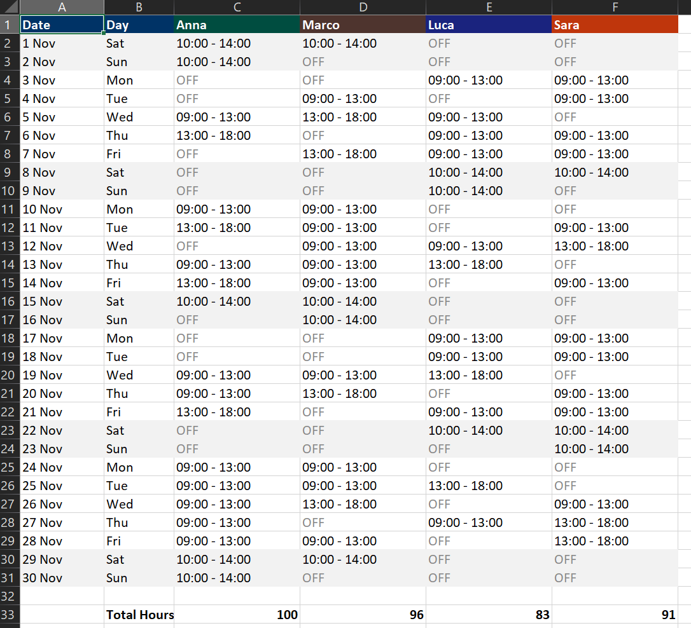

# SmartRoster

A web-based, automatic work schedule generator built with Python (Flask) and openpyxl.

SmartRoster solves the problem of manual schedule creation. It allows a manager to input employees (with their target monthly hours) and the store's shift coverage needs. It then automatically generates a balanced Excel file based on a real calendar, featuring automatic weekend rotation.

**File Excel (Output)**


## Key Features

* **Simple Web Interface:** A clean single page (built with HTML & CSS) to input all data.
* **Intelligent Logic:** The Python-based algorithm assigns shifts while attempting to balance the workload.
* **Hour Balancing:** Aims to meet the target monthly hours defined for each employee.
* **Automatic Weekend Rotation:** Prioritizes employees who did *not* work the previous weekend, ensuring fairness.
* **Real Calendar:** Generates the schedule for a specific month and year (e.g., November 2025), applying shifts to the correct days (e.g., all Mondays).
* **Excel Export:** Produces a clean `.xlsx` file formatted as a "roster" (1 row per day), with different header colors for each employee and a final total of hours.

## Tech Stack

* **Backend:** Python
* **Web Server:** Flask
* **Excel Handling:** openpyxl
* **Frontend:** HTML & CSS

## Installation

To run this project locally, follow these steps.

1.  **Clone or Download the Project**
    Ensure you have the `app.py` file and the `templates/` folder (containing `index.html`).

2.  **Install Dependencies**
    This project requires 3 Python libraries. You can install them using `pip`:

    ```bash
    pip install Flask openpyxl
    ```

## How to Run the Application

1.  **Start the Server**
    Open a terminal in the project's main folder (where `app.py` is located) and run:

    ```bash
    python app.py
    ```

2.  **Open Your Browser**
    Open your web browser (e.g., Chrome, Firefox) and navigate to this address:

    `http://127.0.0.1:5000/`

    You should see the SmartRoster web interface.

## How to Use

1.  **Step 1: Enter Employees**
    In the "1. Enter Employees" box, list your staff. Use the format: `Name,MonthlyTargetHours` (e.g., `Anna,160`).

2.  **Step 2: Enter Shifts**
    In the "2. Enter Shifts to Cover" box, define the weekly shift requirements. Use the format: `DayOfWeek,TimeSlot,RequiredStaff` (e.g., `Monday,09:00 - 13:00,2`).
    *(**Important Note:** The days of the week must be entered in **English** (Monday, Tuesday, etc.) as shown in the placeholder, as the code is set to read them this way).*

3.  **Step 3: Select Period**
    Choose the Month and Year for the schedule you want to generate.

4.  **Generate!**
    Click the "Generate Calendar Schedule" button. Your browser will automatically download the Excel file (e.g., `roster_november_2025.xlsx`) with the completed schedule.